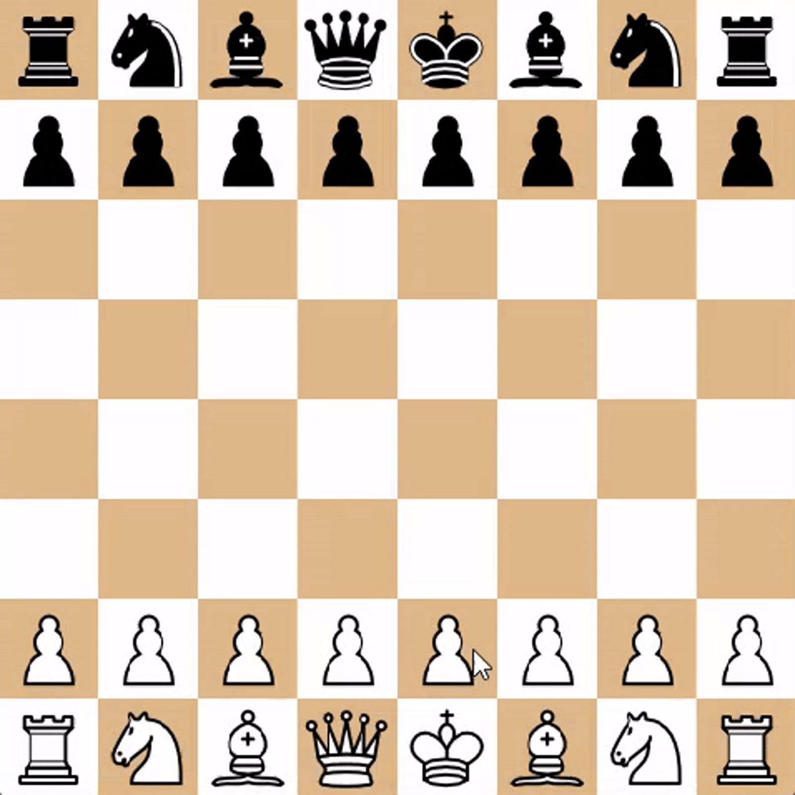

# Chess Engine

Et hobbyprosjekt hvor jeg har utviklet en enkel sjakkmotor i Python med fokus på søkealgoritmer, evaluering og ytelse.

Motoren bruker blant annet:

- Negamax-søk
- Alpha-beta pruning
- Transposition tables
- Enkel posisjonsevaluering
- Move ordering
- Grafisk sjakkbrett for testing og visualisering

#NB
Kun legacy driver fungerer optimalt i dette versjonen.

## Demo

